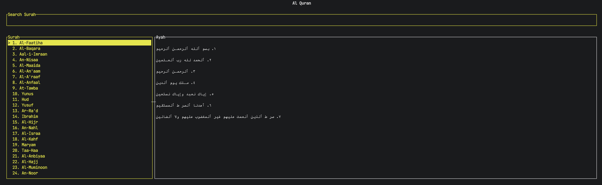

# alquran-tui

[](#)
[](#license)
[](#)

Terminal UI (TUI) app for browsing Al-Qur’an surahs and viewing ayahs, built with Ratatui and powered by the public AlQuran.cloud API.

## Table of Contents

- [Features](#features)
- [Requirements](#requirements)
- [Installation](#installation)
- [Usage](#usage)
  - [Keybindings](#keybindings)
- [Screenshot](#screenshot)
- [API](#api)
- [Development](#development)
  - [Project Structure](#project-structure)
  - [Commands](#commands)
- [Contributing](#contributing)
- [License](#license)
- [Contact](#contact)

## Features

- Browse the list of surahs.
- Search surahs by English name.
- View ayahs for the selected surah.
- Keyboard-driven navigation.

## Requirements

- Rust toolchain (edition 2024)
  - Install via https://rustup.rs
- A terminal that supports ANSI + alternate screen (most modern terminals do)
- Internet access (the app fetches data from AlQuran.cloud)

## Installation

```bash
git clone <your-repo-url>
cd alquran-tui
cargo build
```

## Usage

Run the application:

```bash
cargo run
```

### Keybindings

- Up / Down: Move selection in the focused list
- Left: Focus Surah list (and search)
- Right: Focus Ayah list
- Enter: When Surah list is focused, fetch and display ayahs for the selected surah
- Esc: Quit

## Screenshot



## API

This project uses the public AlQuran.cloud API:

- List surahs: `GET https://api.alquran.cloud/v1/surah`
- Surah details (includes ayahs): `GET https://api.alquran.cloud/v1/surah/{surah_id}`

The app only uses a subset of the JSON response fields to populate:

- `SurahDetail` (e.g., `number`, `englishName`, `numberOfAyahs`, `revelationType`)
- `AyahsList` (e.g., `number`, `text`, `numberInSurah`, `juz`, `page`)

API reference: https://alquran.cloud/api

## Development

### Project Structure

- [src/main.rs](file:///Users/hamam/Documents/_learning/rust/alquran-tui/src/main.rs): TUI loop, rendering, and input handling
- [src/surah.rs](file:///Users/hamam/Documents/_learning/rust/alquran-tui/src/surah.rs): Surah response/data models
- [src/ayah.rs](file:///Users/hamam/Documents/_learning/rust/alquran-tui/src/ayah.rs): Ayah response/data models
- [src/get_surah.rs](file:///Users/hamam/Documents/_learning/rust/alquran-tui/src/get_surah.rs): Surah fetch logic
- [src/get_ayah.rs](file:///Users/hamam/Documents/_learning/rust/alquran-tui/src/get_ayah.rs): Ayah fetch logic

### Commands

```bash
cargo fmt
cargo check
cargo test
```

## Contributing

Contributions are welcome.

- Fork the repository and create a feature branch.
- Keep changes focused and small where possible.
- Run formatting and checks before opening a PR:

```bash
cargo fmt
cargo check
cargo test
```

If you change UI behavior or keybindings, update this README accordingly.

## License

MIT. See the `license` field in [Cargo.toml](file:///Users/hamam/Documents/_learning/rust/alquran-tui/Cargo.toml).

## Contact

- Author: Hamam
